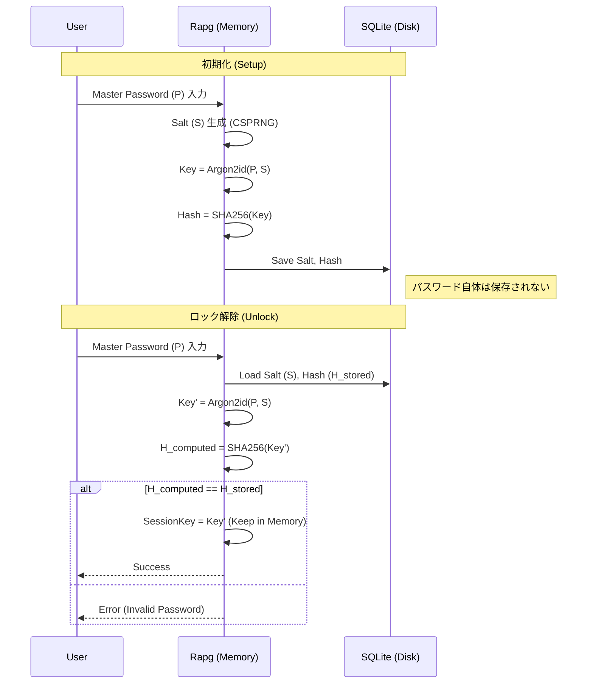
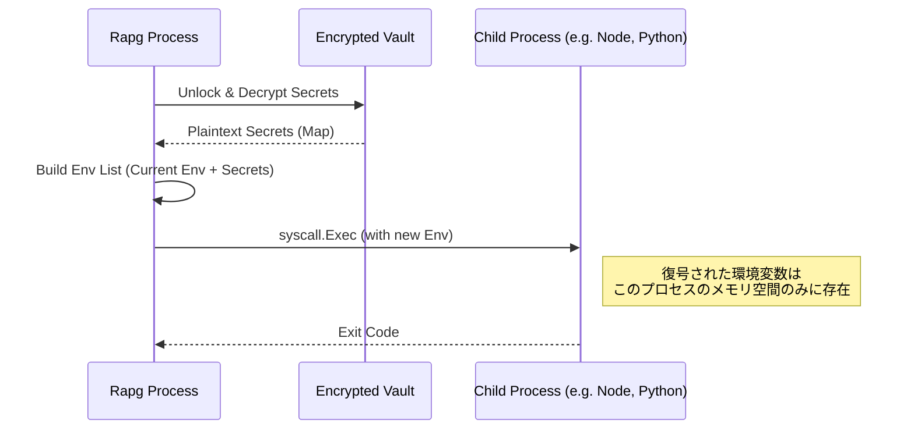

# Rapg 技術仕様書 (Architecture & Security)

Rapg は、**Zero-Knowledge (知識ゼロ)** アーキテクチャと **Local-First** の原則に基づき設計されています。
本ドキュメントでは、そのセキュリティモデル、暗号化フロー、および準拠している国際標準について詳述します。

## 1. セキュリティアーキテクチャ

### 1.1. マスターパスワードとキー導出 (KDF)

ユーザーのマスターパスワードはディスクに一切保存されません。代わりに、**Argon2id** を使用して暗号化キーを導出し、そのキーのハッシュ値のみを検証用に保存します。



### 1.2. データ暗号化 (Authenticated Encryption)

全てのシークレットデータは **AES-256-GCM** を用いて暗号化されます。これにより、機密性（Confidentiality）だけでなく、完全性（Integrity）も保証されます。

- **IV/Nonce:** レコードごとに12バイトのランダム値を生成 (NIST SP 800-38D 推奨)
- **Authentication:** GCMモードによる認証タグがデータの改ざんを検知

```mermaid
flowchart LR
    subgraph Input
        Pass[Password]
        TOTP[TOTP Secret]
        Note[Notes]
        Env[EnvKey]
    end

    subgraph Process
        JSON[JSON Marshal]
        GCM[AES-256-GCM Encrypt]
        Key[Master Key (Memory)]
        Nonce[Random Nonce]
    end

    subgraph Storage
        DB[(SQLite Blob)]
    end

    Input --> JSON
    JSON --> GCM
    Key --> GCM
    Nonce --> GCM
    GCM -->|Ciphertext + AuthTag| DB
    Nonce -->|Prefix| DB
```

---

## 2. ソフトウェアアーキテクチャ

### 2.1. Environment Injection (プロセス分離)

`rapg run` コマンドは、一時ファイルを作成することなく、メモリ上で子プロセスに環境変数を注入します。



---

## 3. 準拠標準・参考文献 (References & Standards)

Rapgの実装は、以下の RFC (Request for Comments) および NIST 標準規格に準拠しています。

### 3.1. 暗号化・ハッシュ関数

*   **RFC 9106**: *Argon2 Memory-Hard Function for Password Hashing and Proof-of-Work Applications*
    *   **採用理由:** GPUやASICによる総当たり攻撃への耐性が最強クラスであり、サイドチャネル攻撃に強い `id` モードを採用しています。
    *   **Rapg実装:** `golang.org/x/crypto/argon2`
*   **NIST SP 800-38D**: *Recommendation for Block Cipher Modes of Operation: Galois/Counter Mode (GCM)*
    *   **採用理由:** 認証付き暗号 (AEAD) のデファクトスタンダードであり、多くのCPUでハードウェアアクセラレーションが効くため高速です。
*   **RFC 5116**: *An Interface and Algorithms for Authenticated Encryption*
    *   AEADアルゴリズムのインターフェース定義。

### 3.2. 多要素認証 (MFA/TOTP)

*   **RFC 6238**: *TOTP: Time-Based One-Time Password Algorithm*
    *   **採用理由:** Google AuthenticatorやAuthyなど、全ての標準的な2FAアプリと互換性を持たせるため。
    *   **Rapg実装:** `github.com/pquerna/otp`
*   **RFC 4226**: *HOTP: HMAC-Based One-Time Password Algorithm*
    *   TOTPの基礎となる規格。

### 3.3. セキュリティガイドライン

*   **OWASP Password Storage Cheat Sheet**
    *   パスワード保存におけるソルトの取り扱い、強力なハッシュ関数の選択（Argon2id）の根拠としています。
*   **Local-First Software** (Ink & Switch)
    *   「ユーザーがデータを所有し、クラウドに依存せず、オフラインで動作する」というRapgの設計思想のベースです。